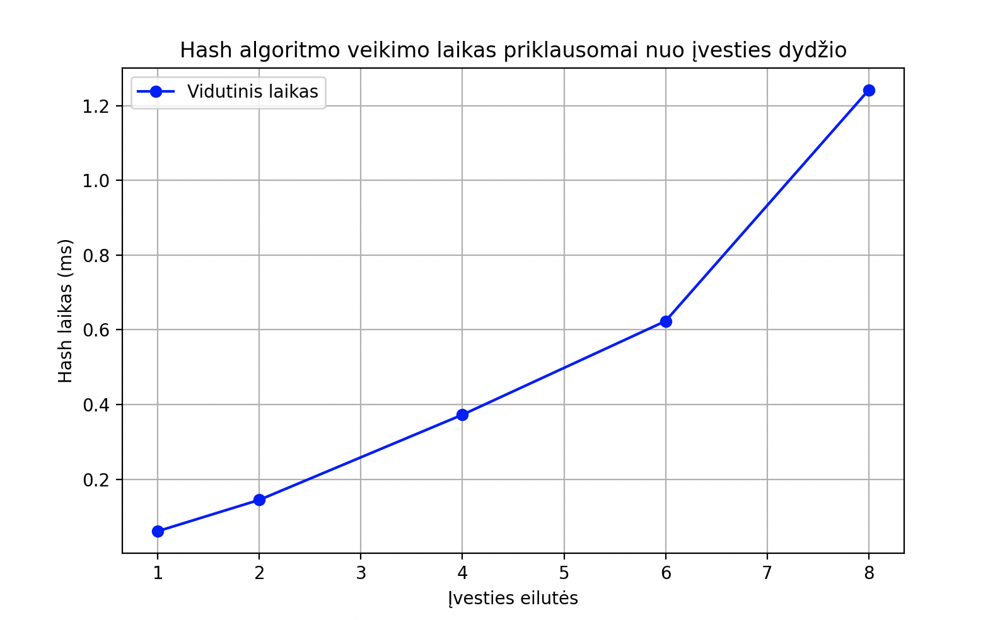

# Blockchain

## APRAŠYMAS
Šiame projekte realizuota paprasta **hash funkcija**, paremta:
- **SALT generavimu** – iš pranešimo simbolių sukuriamas 16 baitų masyvas.
- **Bubble sort** – duomenys (salt + pranešimas) rikiuojami, o kiekvieno swap metu atnaujinamas hash.

Tikslas: parodyti, kaip iš paprastų veiksmų galima sukonstruoti deterministinę, fiksuoto ilgio hash funkciją.

---
## ALGORITMO DETALĖS

### 1. Hash atnaujinimo formulė
Kiekvieno **swap** metu bubble sort’e hash atnaujinamas:
```cpp
h = (h << 3) + (h >> 2) + (a * 17 + b * 31 + j * 13)
```

kur:
- `h` – dabartinė hash reikšmė
- `(h << 3)` – hash pastumtas į kairę per 3 bitus (padaugintas iš 8)
- `(h >> 2)` – hash pastumtas į dešinę per 2 bitus (padalintas iš 4)
- `a`, `b` – sukeičiamų simbolių ASCII kodai
- `j` – jų pozicija masyve
- konstantos `17`, `31`, `13` – parinktos tam, kad padidintų rezultatų įvairovę

### Kodėl tai svarbu?
- Be bubble sort – hash beveik nekistų.
- Su bubble sort – kiekvienas swap įmaišo naują informaciją, todėl hash priklauso ne tik nuo simbolių, bet ir nuo jų tvarkos.

---

### 2. SALT generavimas
Salt sudaromas iš įvesties simbolių:

```cpp
for (size_t i = 0; i < msg.size(); i++) {
    salt[i % 16] = (salt[i % 16] + (uint8_t)msg[i] + (i * 13)) & 0xFF;
}
```

kur:
- i % 16 – pasirenkama, kurį iš 16 salt elementų atnaujinti.
- (uint8_t)msg[i] – simbolio ASCII reikšmė.
- (i * 13) – priklausomybė nuo pozicijos.
- & 0xFF – užtikrina, kad reikšmė liktų 0–255 (vienas baitas).

---

## PSEUDO KODAI

> **Salt generavimas**
>
> ```text
> FUNKCIJA MAKE_SALT(MSG):
>     SALT = {0,0,...,0}
>
>     CIKLAS i nuo 0 iki MSG_ilgis-1:
>         idx = i MOD 16
>         SALT[idx] = ( SALT[idx] + ASCII(MSG[i]) + i*13 ) MOD 256
>
>     GRĄŽINTI SALT
> ```

> **Bubble sort su hash atnaujinimu**
>
> ```text
> FUNKCIJA BUBBLE_SORT_AND_HASH(DATA, STATE[8]):
>     n = DATA_ilgis
>
>     CIKLAS i nuo 0 iki n-2:
>         CIKLAS j nuo 0 iki n-2-i:
>             JEI DATA[j] > DATA[j+1]:
>                 a = ASCII(DATA[j])
>                 b = ASCII(DATA[j+1])
>                 idx = j MOD 8
>
>                 STATE[idx] = (STATE[idx] << 5)
>                              + (STATE[idx] >> 3)
>                              + (a*17 + b*31 + j*13)
>
>                 sukeisti DATA[j] ir DATA[j+1]
>
>     GRĄŽINTI STATE
> ```

> **Pagrindinė programa**
>
> ```text
> MSG <- perskaityti visą tekstą iš failo
> SALT <- MAKE_SALT(MSG)
>
> DATA <- SALT || MSG   // pirmiausia salt, po to pranešimas
>
> STATE[0..7] <- inicializuoti pagal MSG - seed
>                (ilgis, pirmas simbolis, paskutinis simbolis, konstantos)
>
> HASH <- BUBBLE_SORT_AND_HASH(DATA, STATE)
> ```

---

## EKSPERIMENTINIAI TYRIMAI

### Rezultatai

| Failas       | Įvestis (trumpai)                     | Hash (256-bit, 64 hex)                                                 |
|--------------|---------------------------------------|------------------------------------------------------------------------|
| empty.txt    | tuščias failas                        | 0002063502cf45f7057b2f840789cc4162aac918c15576bd8f0f540ae3c3c385       |
| one_a.txt    | simbolis `a`                          | 0002c5951b40e21b352ac63c078a8ba162ab8878c156361d8f0e6c25e3c3d679       |
| one_b.txt    | simbolis `b`                          | 0002c7c81b88cf5235b71772078a8dd462ab8aabc15638508f0e725ce3c3d66a       |
| random1.txt  | >1000 atsitiktinių simbolių           | 872d9dcfb5e4b0351fdd173d5b47246f7210a7e4ff293ea3fe3a7fa056b942b9       |
| random2.txt  | >1000 atsitiktinių simbolių, skiriasi 1 simboliu | 41bd2ca244096d234bdc93744192f2f7ca79ca5f4ad33a91f88e5f916fb1f514 |

---

### Išvados
- **Fiksuotas ilgis**: visų rezultatų ilgis vienodas (64 hex simboliai).  
- **Deterministiškumas**: tas pats failas duoda tą patį hash’ą.  
- **Lavinos efektas**: net 1 simbolio skirtumas (`random1.txt` vs `random2.txt`) kardinaliai pakeičia hash.

---

## EFEKTYVUMO TYRIMAI

Hash algoritmo veikimo laikas buvo pamatuotas su skirtingu eilučių kiekiu iš failo `konstitucija.txt`.  
Kiekvienas testas kartotas 5 kartus, o žemiau pateikiamas **vidurkis**.

| Eilučių sk. | Vidutinis laikas (ms) |
|-------------|------------------------|
| 1           | 0.0601                 |
| 2           | 0.1443                 |
| 4           | 0.3726                 |
| 6           | 0.6232                 |
| 8           | 1.2418                 |




### Išvados
- Laikas auga kvadratiniu greičiu didėjant įvesties ilgiui.  
- Tai atitinka **Bubble Sort** algoritmą, kuris yra `O(n²)`.  
- Net su palyginti nedideliais duomenimis (8 eilutės), laikas padidėjo ~20× lyginant su 1 eilute.

---

## KOLIZIJŲ PAIEŠKA


Sugeneruota po **100 000 atsitiktinių stringų porų** skirtingo ilgio (10, 100, 500, 1000 simbolių).
Patikrinta, ar jų hash’ai sutampa.

Šis eksperimentas buvo atliktas naudojant **OpenMP**.
Kiekviena gija sugeneruodavo savo atsitiktinių stringų poras ir skaičiavo jų hash’us, o rezultatai buvo apjungti.  
Tai ženkliai pagreitino skaičiavimus (ypač su ilgais stringais). Be OpenMP eksperimentas būtų trukęs kelis kartus ilgiau.

| Ilgis (len) | Porų skaičius | Kolizijų skaičius | Kolizijų dažnis | Laikas (s) |
|-------------|---------------|-------------------|-----------------|------------|
| 10          | 100 000       | 0                 | 0               | 0.033      |
| 100         | 100 000       | 0                 | 0               | 0.448      |
| 500         | 100 000       | 0                 | 0               | 6.633      |
| 1000        | 100 000       | 0                 | 0               | 28.005     |

**Išvada:** kolizijų nerasta. Laikas auga labai sparčiai, nes bubble sort yra O(n²).

---

## LAVINOS EFEKTO EKSPERIMENTAS

**Tikslas:** patikrinti, kaip pasikeičia hash rezultatas, jei įvesties eilutėje pakeičiame tik **vieną simbolį**.  
Atlikta su **100 000 porų** (stringo ilgis = 20 simbolių).  

Rezultatai:  

| Matavimo lygmuo | Min  | Max    | Vidurkis |
|-----------------|------|--------|----------|
| Bitų lygmuo (256 bitų hash) | 0%   | 63.7%  | 45.7%   |
| Hex lygmuo (64 simboliai)   | 0%   | 100%   | 85.7% |

**Išvados:**  
- **Bitų lygmuo (~45–50%)** rodo, kad algoritmas turi lavinos efektą – pakeitus vieną simbolį, pasikeičia apie pusė hash bitų.  
- **Hex lygmuo (~85%)** yra didesnis, nes skaičiuojamas pagal viso hex simbolio (4 bitų) pasikeitimą – todėl jis iškreipia tikrąją statistiką.
- **Min=0%** rodo, kad kai kuriose porose hash’ai nesiskyrė → galimos kolizijos.  
- **Max arti 100%** rodo, kad kartais hash’ai skiriasi visiškai.

---

## NEGRĮŽTAMUMO DEMONSTRACIJA (Hiding / Puzzle-friendliness)

Paleidus programą su failu `input/negriztamas.txt` (turinčiu tekstą `negriztamas`):

Gauname hash: 4e73cfa552ea40a6052b481c8770d00b663d26bd2a32a502370eb811aea2190f

**Išvados:**
- Iš hash’o neįmanoma atspėti, jog pradinis tekstas buvo `negriztamas`.  
- Pakeitus vieną simbolį (`negriztamas1`) hash pasikeičia: ea01459beb53c8fae646162629330ea571d3c8035684168e966c033052b47ee1(lavinos efektas).  
- Net jei turime hash ir salt, nėra greito būdo atsukti procesą ir gauti pradinį tekstą (**puzzle-friendliness**).  
- Tai rodo **negrįžtamumą**: hash funkcija yra vienkryptė.

----

## IŠVADOS:

### Stiprybės
- Sukurtas hash algoritmas visada duoda tą patį rezultatą iš tos pačios įvesties, todėl jis yra patikimai **deterministinis**.  
- Atlikti bandymai parodė aiškų **lavinos efektą** – pakeitus tik vieną simbolį, visas hash rezultatas stipriai pasikeičia.  
- Hash išvestis atrodo kaip atsitiktinis skaičių rinkinys, todėl praktiškai **neįmanoma atspėti pradinio teksto vien tik iš hash’o**.  
- Įmaišomas **salt** papildomai apsunkina hash atspėjimą, nes net ta pati žinutė gali turėti skirtingą hash.

### Silpnybės
- Mano sugalvotas hash paremtas **bubble sort algoritmu**, kuris nėra efektyvus. Dideliems failams skaičiavimas tampa labai lėtas.  
- Naudojamas **deterministinis salt** (apskaičiuotas iš pačios žinutės), todėl jis neatlieka tikros atsitiktinės druskos funkcijos, kaip naudojama realiose saugumo sistemose.  
- Teoriškai galimos **kolizijos** (skirtingos žinutės gali duoti tą patį hash), nors testuose jų beveik nepastebėta.

----
 
## PALYGINIMAS SU STANDARTINIAIS HASH (papildomai)

### Lavinos efektas

Atliktas lavinos efekto testas (10000 porų, stringo ilgis = 20), palyginant mano hash su MD5, SHA-1 ir SHA-256.

Rezultatai:

| Algoritmas   | Hex lygmuo (vidurkis) |
|--------------|------------------------|
| Mano hash    | ~85.4%                 |
| MD5          | ~93.7%                 |
| SHA-1        | ~93.7%                 |
| SHA-256      | ~93.8%                 |

**Išvados:**  
- Mano hash parodo lavinos efektą, bet jis silpnesnis ir mažiau stabilus.  
- Standartiniai hash algoritmai (MD5, SHA-1, SHA-256) pasižymi labai stipriu lavinos efektu (~94%).  idealiam lavinos efektu (~94%).  
